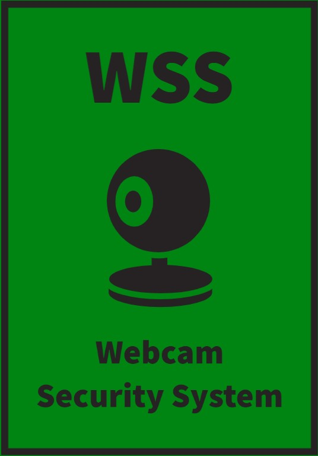

<!-- PROJECT LOGO -->
 

  

  <h3 align="center">Webcam Security System</h3>

  

    WSS is an affordable home security camera with facial recognition, phone alerts, and smart home controls. 
     
    <a href="https://github.com/othneildrew/Best-README-Template"><strong>Explore the docs »</strong></a>
     
     
  

<!-- TABLE OF CONTENTS -->

  
Table of Contents

  <ol>
    <li>
      <a href="#about-the-project">About The Project</a>
      <ul>
        <li><a href="#built-with">Built With</a></li>
      </ul>
    </li>
    <li>
      <a href="#getting-started">Getting Started</a>
      <ul>
        <li><a href="#prerequisites">Prerequisites</a></li>
        <li><a href="#installation">Installation</a></li>
      </ul>
    </li>
    <li><a href="#usage">Usage</a></li>
    <li><a href="#contact">Contact</a></li>
  </ol>

<!-- ABOUT THE PROJECT -->
## About The Project

This is a great and easy way to keep track of who enters your home when your away. The Webcam Security System is the cheapest way to keep tabs on your home and family. WSS uses facial recognition to tell you exactly who is entering your home and even offers smart home connectivity to prepare your home for your arival. 

Here's why:
* Home security should be cheap and easily accessible 
* Everyone deserves to know who and when people enter their home

(<a href="#readme-top">back to top</a>)

### Built With

* Python 3

(<a href="#readme-top">back to top</a>)
